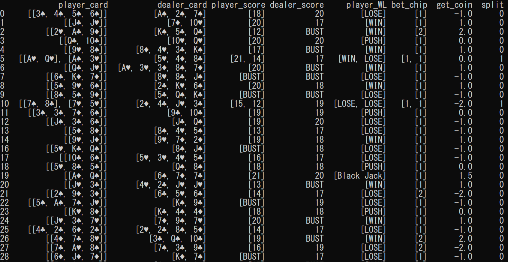

# <div align="center">black-jack</div>
##### <div align="center">Simulate Black Jack based on "Basic strategy"</div>
##### <div align="center">Analyze dataframe made by Black Jack simulation.</div>
##### <div align="center">And show how to play perfect Black Jack.</div>
<div align="center">

</div>

---
## Basic strategy
ベーシックストラテジーとは，プレイヤーの行動選択のチートシートです．  
プレイヤーは自分の手札とディーラーの表向きになっているカードを見比べて，カードをもらうといったアクションを行います．自分の手札と表向きになっているディーラーの手札の組み合わせは，一般的に290通りに絞ることができ，各パターンにおけるプレイヤーのアクションの期待値を求めることができます．  
その期待値に沿って作られたものが，行動選択のチートシートがベーシックストラテジーです．

## Details
まず最初に，ブラックジャックは心理の要素はなく，完全に数学的，確率に基づいた戦いであると言えます．
ブラックジャックは，ベーシックストラテジーに乗っ取って機械的にプレイすることが最も期待値が高く合理的です．またディーラーも基本的に意思はなく，ルールに従い機械的に行動します．したがって，完全なコンピュータシミュレーションが可能となります．  
しかし，実際にベーシックストラテジーに沿って行動することの重要性を本プロジェクトを通して解き明かします．  
本プロジェクトはプレイヤー１人対ディーラーの戦いをシミュレーションし，その勝負結果をDataFrameに落とし込くことでデータ分析を行うことができます．  
本プロジェクトを利用してできることは以下の通りとなっています．
- ブラックジャックの勝負データを得ることができる．
- 指定した回数，対戦を行うことでより正確な分析を行うことができる．
- 分析クラスを活用することができる．

## Software, Library
- ipython
- pandas
- numpy
- matplotlib

## Sample code
#### データフレームを作成し，勝率確率の推移を見るモデル処理．

```
cd analysis
import analysis_black_jack as abj
a = abj.MakeDataFrame(GAME_TIME=1000000, DECK=5, RE_PLAY=False, MAX_PLAY_COUNTS=5) #GAME_TIMEで対戦回数を指定できる．
df = a.main()
b = abj.AnalysisDf(df)
b.win_percentage()
```


