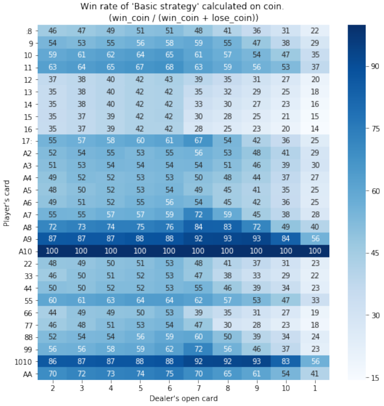

# black-jack
Simulate Black Jack based on "Basic strategy"  
Analyze dataframe made by Black Jack simulation.  
And show how to play perfect Black Jack.

## Basic strategy
A basic strategy is a cheat sheet for player action selection.  
The player acts by comparing his hand with the face-up card of the dealer. You can generally narrow down the combination of your hand and the face-up dealer's hand to 290 ways. The basic strategy provides the player's best action from the expected value in each pattern.  

<div align="center">

</div>

## Details
First of all, Blackjack has no psychological warfare elements and is completely mathematical and probabilistic.  
Hijacking the basic strategy and playing mechanically is the most expected value. In addition, the dealer does not have his own intention according to the rules and acts mechanically. Therefore, it is possible to completely reproduce blackjack using a basic strategy by computer simulation.  
This project can analyze blackjack by simulating the battle between one player and the dealer and recording the result of the battle in DataFrame. Then, we will clarify the importance of actually acting according to the basic strategy.  
The features and merits of using this project are as follows.  
- You can get blackjack game data.
- A more accurate analysis can be performed by playing a specified number of times.
- Analysis classes can be used.

## Software, Library
- ipython 7.19.0
- pandas
- numpy
- matplotlib

## Sample code
#### Creating DataFrame
In this example, we will create a data frame that records the game record data of 10000000 times of Blackjack.  
You can customize the number of matches by "GAME_TIME".

```
cd ~/analysis
import make_dataframe

a = make_dataframe.MakeDataFrame(GAME_TIME=10000000, DECK=6, RESET=False, basic_strategy_num="")
df = a.main()
```

<div align="center">

</div>

#### The columns of df are as follows.

|  Columns  |  Detail |
| ---- | ---- |
|  player_card  |  Player's final hand. When split, it is divided into multiple lines.  |
|  dealer_card  |  Dealer's final hand.  |
|  player_score  |  The score of the player's hand. When split, it is divided into multiple lines.  |
|  dealer_score  |  The score of the dealer's hand.   |
|  player_WL  |  Player victory or defeat. One of "WIN", "LOSE", "PUSH" or "Black Jack". When split, it is divided into multiple lines.  |
|  bet_chip  |  The number of coins bet. Normally there is only one, and only when double down, two are bet.  |
|  play_counts  |  The number of consecutive matches. When play_counts is 1, a new deck is created and the cards are shuffled.  |
|  get_coin  |  Earned coins calculated from player_WL and bet_chip. 1.5 times for "Black Jack".  |
|  first_PC  |  Player's hand. Obtained from the basic strategy column.  |
|  first_DC  |  Dealer's open card. Obtained from the basic strategy index.  |
|  split  |  The number of splits.  |

#### Visualize the transition of winning percentage probability.

```
import analysis_black_jack as abj

b = abj.AnalysisDf(df)
# Graph the transition of the winning percentage by dividing it into 1000.
cut_num_list, percentage = b.win_percentage(how="cut", split=1000, plot=True)
```


#### Win rate of each basic strategy.

```
b = abj.AnalysisDf(df)
basic_strategy_percentage = b.basic_strategy_win_percentage(plot=True, win_coin=False)
```




#### Create an optimized basic strategy.

You can create a newly optimized basic strategy.  
Based on the output basic strategy, blackjack simulation is performed again, and it is optimized by repeating it.  
The example below is optimized for 7 generations.

```
c = abj.MakeBasicStrategy(GAME_TIME=5000, generations=7)
new_bs = b.main()
```


## Jupyter notebook
I created a .ipynb as a sample for data analysis.  
See the "ipynb/" directory.

## Author
Name: Jumpei Kajimoto  
Email: jay0423@i.softbank.jp
